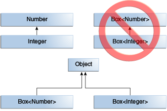

### 1、泛型的概念
所谓泛型，就是指在定义一个类、接口或者方法时可以指定类型参数。这个类型参数我们可以在使用类、接口或者方法时动态指定。  
### 2、泛型的使用
**泛型有三种使用方式，分别为：泛型类、泛型接口、泛型方法**
### 3、泛型擦除
泛型擦除是指java中的泛型只在编译器有效，在运行期间会被擦除掉。在运行期间类型为Object，最终通过强转得到具体类型。  
在编译期编译之后，泛型的擦除规则如下：
* List<>擦除后的类型为List
* List<>[] 擦除后的类型为 List[]；
* List<? extends E>、List<? super E> 擦除后的类型为 List；
* List<T extends Serialzable & Cloneable> 擦除后类型为 List。  

可以理解

* 泛型类的class对象相同
```java
public static void main(String[] args) {  
    List<String> ls = new ArrayList<String>();  
    List<Integer> li = new ArrayList<Integer>();  
    System.out.println(ls.getClass() == li.getClass());  
}  
```
* 无法声明泛型数组
```java
List<String>[] list = new List<String>[];  
```
* instaceof 不允许存在泛型参数
```java
List<String> list = new ArrayList<String>();  
//在运行时list的泛型参数会被删除，所以判断不了类型
System.out.println(list instanceof List<String>)
```
### 4、泛型的继承
__泛型类的继承关系不是由泛型参数的继承关系来决定的__。比如说Box类是一个泛型类，现在给这个类赋两个类型参数Integer和Number，虽然Integer是Number的子类，但是Box和Box没有任何关系，他们之间唯一的关系就是他们都是Object的子类.  
  
__如果想要两个泛型类之间具有继承关系，那么我们需要定义这个两个泛型类本身之间具有继承关系，而不是泛型参数之间具有泛型关系__。JDK中有很多这种列子，我们可以拿List和ArrayList做一个列子。
```java
public interface List<E> extends Collection<E> {
    ...
}

public class ArrayList<E> extends AbstractList<E> implements List<E>, RandomAccess, Cloneable, java.io.Serializable{
    ...
}
```
### 5、泛型通配符
**泛型统配符一般使用在泛型类的定义和泛型方法的定义**。也就是说泛型通配符主要使用在类和方法的定义中。很少在具体的使用中用到（List<？>这种情况使用的很少），所以关于泛型统配符我们重点掌握使用通配符进行泛型的定义就好了。
```java
    //表示类型参数可以是任何类型
    public class Apple<?>{}
    //表示类型参数必须是A或者是A的子类
    public class Apple<T extends A>{}
    //表示类型参数必须是A或者是A的超类型
    public class Apple<T supers A>{}
    //定义泛型方法，表示参数必须是ApplicationContext的子类
    public static  <T extends ApplicationContext> List<T> getList(T type)
```
**对于List等集合使用通配符的理解**
> 对于List等集合类型使用通配符时，无法向list中添加元素，list规定集合中只能存在一种类型的元素，如果允许添加元素，可能会出现list内存在多种类型元素的情况。  
> 对于通配符的理解：通配符用于限定该集合内的元素的范围，但是具体使用时只能为一种符合条件的类型  
> T extends A 表明该集合中的元素必须是A的子类，限定上界，get取到的元素皆为A类型  
> T supers A 表明该集合中的元素必须是A的超类（父类），限定下界，get取到的元素为Object类型，使用时需强转  
### 6、泛型中KTVE的含义
* E： Element (在集合中使用，因为集合中存放的是元素)
* T：Type（Java 类）
* K： Key（键）
* V： Value（值）
* N： Number（数值类型）
* ？： 表示不确定的java类型
* S、U、V：2nd、3rd、4th types